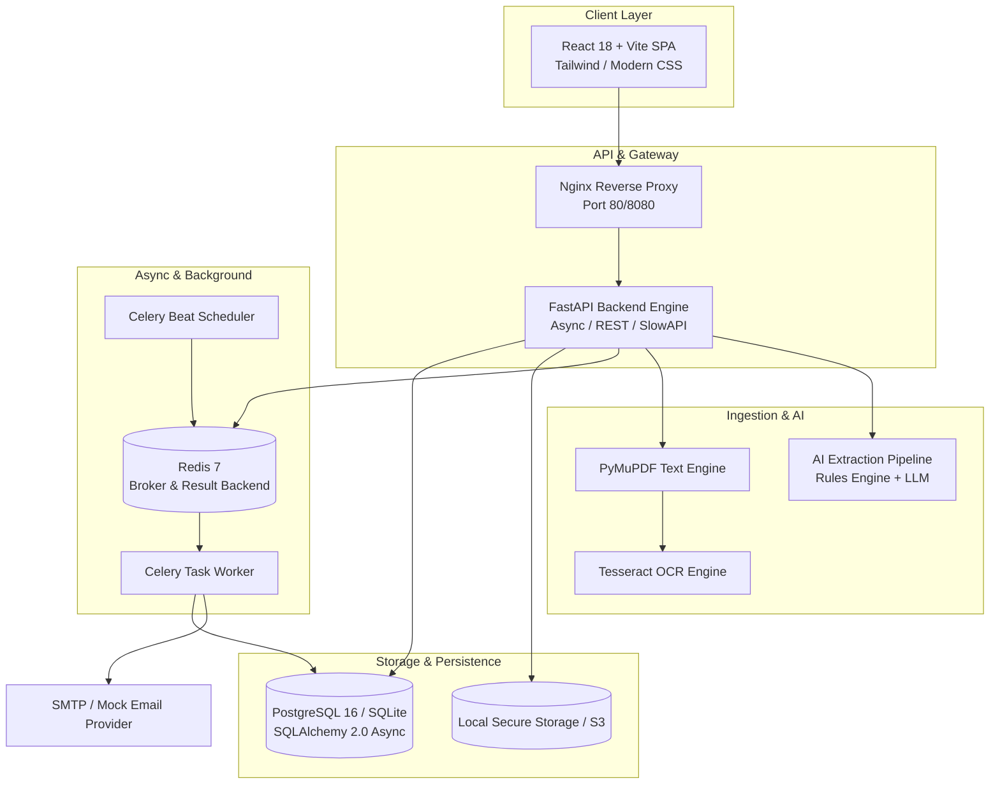

# SMARTINVOICE 🧾⚡

> **"Automate invoices. Track expenses. Never miss a payment."**

SmartInvoice is a production-grade, full-stack SaaS automation platform designed for modern businesses, finance teams, and SMBs. It streamlines the entire invoice lifecycle—from document ingestion and AI extraction to approval workflows, expense categorization, payment tracking, automated reminders, and financial analytics.

---

## 🚀 Key Highlights & Architecture



### ✨ Core Features

1. **📄 Intelligent Document Ingestion & Extraction**
   - Direct upload of PDF, PNG, JPG, JPEG invoices up to 20MB.
   - Dual-engine text parser: Fast direct text extraction via PyMuPDF with fallback OCR.
   - AI-powered structured extraction for Vendor, Invoice #, Line Items, Tax (GST/VAT), Subtotals, Due Dates, and Payment Terms.
   - Confidence scoring, confidence flags, and human-in-the-loop manual review interface.

2. **🏢 Vendor Intelligence & Deduplication**
   - Automated vendor profiling, normalization, and deduplication.
   - Lifetime vendor spend tracking, average payment turnaround times, and transaction histories.

3. **💳 Expense Tracking & Payment Reconciliation**
   - Categorized expenses (Software, Marketing, Travel, Equipment, Utilities, etc.).
   - Multi-method payment reconciliation (Bank Transfer, UPI, Credit Card, Cash, Cheque).
   - Partial payment support with automatic balance tracking and status transitions.

4. **📊 Analytics, Cashflow & Tax Reports**
   - Executive KPIs: Total Spend, Incurred Expenses, Outstanding Balances, Overdue Aging.
   - Monthly Burn Rate & Inflow/Outflow cash flow trends.
   - Tax Breakdown Reports (GST/VAT output/input with CSV/PDF exportable data).

5. **⚡ Async Background Automation & Email Notifications**
   - Celery + Redis distributed job architecture.
   - Daily automated invoice due-date scanner & overdue state machine updater.
   - Email reminder dispatch with SMTP and Console/Mock abstractions.
   - Idempotent task execution with automated retry backoffs.

6. **🔒 Enterprise Security & RBAC**
   - Role-Based Access Control (`ADMIN`, `STAFF`, `VIEWER`).
   - JWT authentication with secure password hashing (`bcrypt`/`passlib`).
   - SlowAPI distributed rate limiting across authentication and file endpoints.
   - Full security headers (`Content-Security-Policy`, `X-Frame-Options: DENY`, `X-Content-Type-Options: nosniff`).
   - Tamper-evident Audit Logging for all invoice mutations and payment actions.

---

## 🛠️ Tech Stack

- **Backend**: Python 3.12+, FastAPI, SQLAlchemy 2.0 (Async + Sync), Pydantic v2, Alembic, Celery, Redis, PyMuPDF, SlowAPI.
- **Frontend**: React 18, Vite, React Router v6, Lucide Icons, Modern CSS Design System.
- **Database**: PostgreSQL 16 (Production / Docker), SQLite (Local / Test Suite).
- **Containerization**: Multi-stage Dockerfiles, Docker Compose, Nginx Alpine.

---

## 📦 Quickstart with Docker Compose

The fastest way to launch the entire multi-container SmartInvoice ecosystem:

```bash
# 1. Clone the repository
git clone https://github.com/your-org/smartinvoice.git
cd smartinvoice

# 2. Copy the environment file
cp .env.example .env

# 3. Build and launch all 6 services (FastAPI, React Frontend, Celery Worker, Celery Beat, PostgreSQL, Redis)
docker compose up --build
```

Access the applications at:
- **Frontend Web UI**: [http://localhost](http://localhost) (or `http://localhost:80`)
- **FastAPI Backend API**: [http://localhost/api/v1/health](http://localhost/api/v1/health)
- **Interactive Swagger Docs**: [http://localhost:8000/docs](http://localhost:8000/docs) (or directly via `/docs`)

---

## 💻 Local Development Setup

If running backend and frontend services on your host machine:

### 1. Backend Setup

```bash
cd backend

# Create and activate virtual environment
python -m venv .venv
source .venv/bin/activate  # On Windows: .venv\Scripts\activate

# Install dependencies
pip install -r requirements.txt

# Run database migrations
alembic upgrade head

# Seed demo data (Admin, Staff, Viewer, sample vendors, invoices, payments, expenses)
python -m app.database.seed

# Start FastAPI development server
uvicorn app.main:app --reload --port 8000
```

### 2. Celery Worker & Scheduler (Optional for Local Reminders)

```bash
# In a separate terminal with active backend .venv:
celery -A app.tasks.celery_app.celery_app worker --loglevel=info

# In another terminal for scheduled tasks:
celery -A app.tasks.celery_app.celery_app beat --loglevel=info
```

### 3. Frontend Setup

```bash
cd frontend

# Install node dependencies
npm install

# Start Vite dev server with proxy to :8000
npm run dev
```

Open [http://localhost:5173](http://localhost:5173) in your browser.

---

## 👥 Demo Credentials (Pre-Seeded)

The database seed script generates 3 standard user roles:

| Role | Email | Password | Permissions |
| :--- | :--- | :--- | :--- |
| **Admin** | `admin@smartinvoice.dev` | `Password123!` | Full system access, User management, Settings, Audits |
| **Staff** | `staff@smartinvoice.dev` | `Password123!` | Invoice creation, AI extraction, Payments, Expenses |
| **Viewer** | `viewer@smartinvoice.dev` | `Password123!` | Read-only access to Invoices, Vendors, and Reports |

---

## 🧪 Testing & Quality Assurance

SmartInvoice includes an automated unit and integration test suite with 100% test pass rate:

```bash
cd backend
pytest -v
```

**Test Coverage Highlights:**
- `test_phase1_auth.py`: User registration, JWT login, Role verification, Profile fetching.
- `test_phase2_invoices.py`: Document upload, Storage persistence, PyMuPDF parsing, Invoice CRUD.
- `test_phase3_ai_extraction.py`: AI extraction pipeline, confidence score validation, review approval.
- `test_phase4_vendors_expenses_payments.py`: Vendor intelligence, partial/full payment reconciliation, expense tracking.
- `test_phase5_analytics.py`: Financial KPIs, burn rate, cash flow trends, tax reporting endpoints.
- `test_phase6_notifications.py`: Celery tasks, mock email providers, overdue scanner, in-app notification center.
- `test_phase7_security_ratelimit.py`: SlowAPI rate limit enforcement, security headers, correlation IDs.

---

## 📡 API Endpoints Overview

| Area | Method | Endpoint | Description |
| :--- | :--- | :--- | :--- |
| **Auth** | `POST` | `/api/v1/auth/login` | JWT OAuth2 access token generation |
| **Auth** | `POST` | `/api/v1/auth/register` | User onboarding (Admin only or Public configured) |
| **Invoices** | `POST` | `/api/v1/invoices/upload` | Ingest PDF/image invoice document |
| **Invoices** | `POST` | `/api/v1/invoices/{id}/extract` | Trigger AI extraction pipeline |
| **Invoices** | `GET` | `/api/v1/invoices` | List and filter invoices by status, date, vendor |
| **Vendors** | `GET` | `/api/v1/vendors` | Retrieve vendor profiles and metrics |
| **Payments** | `POST` | `/api/v1/payments` | Record payment & trigger auto-reconciliation |
| **Expenses** | `POST` | `/api/v1/expenses` | Log business expense with category |
| **Analytics**| `GET` | `/api/v1/analytics/dashboard` | Executive KPIs, cashflow, burn rate & tax summary |
| **Audit** | `GET` | `/api/v1/audit-logs` | Immutable audit trail viewer |
| **Notifications** | `GET` | `/api/v1/notifications` | In-app notification center |

---

## 🛡️ License

This project is distributed under the **MIT License**.
